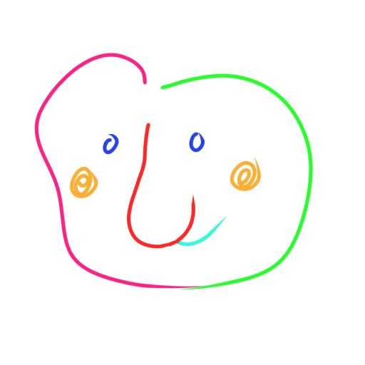
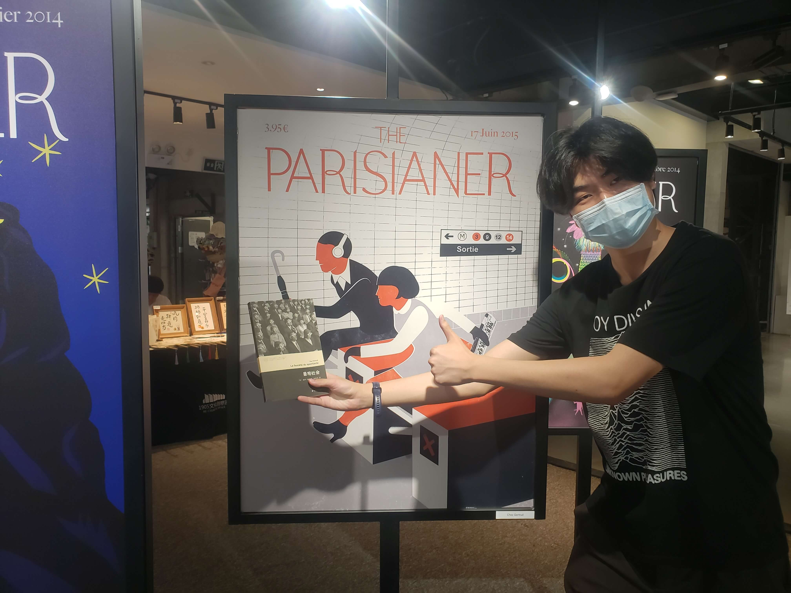

# Saluton!

My name is *Guanyun Lu*, et mon nom en espéranto est *malbona*（如同英文中的“bad”）.  
我最喜欢的动物是长鼻猴(*Nasalis Larvatus*)。这是我的同学为我设计的头像。

~~您可以通过搜索*malbona*这一ID在某些网站找到我，si vous voulez。~~

在夏天：一张照片……

爱好文学、哲学、电影、音乐等非专业领域内容，  
业余从事文本再生工作。  
C'est tout.   
Koran dankon.   
See you soon.
